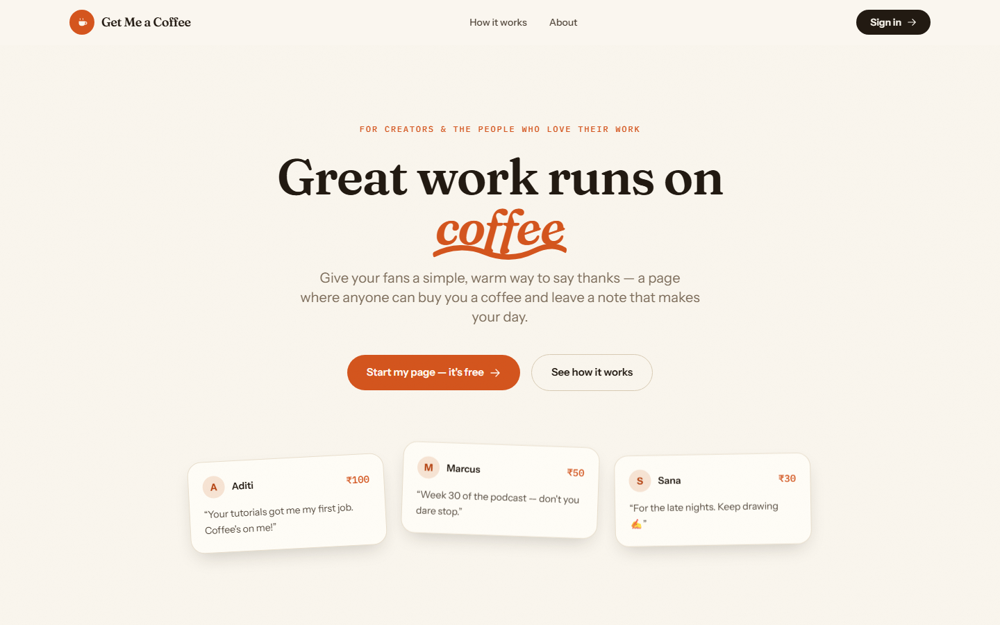
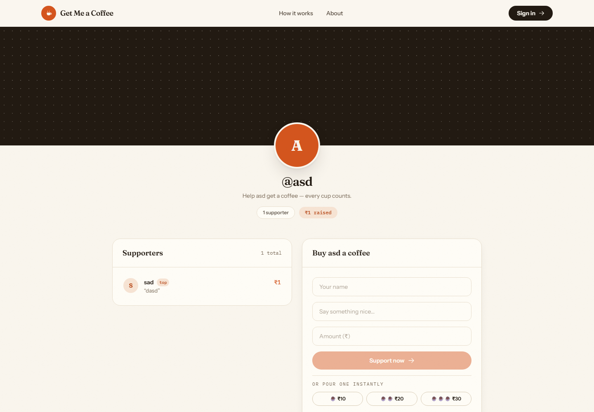
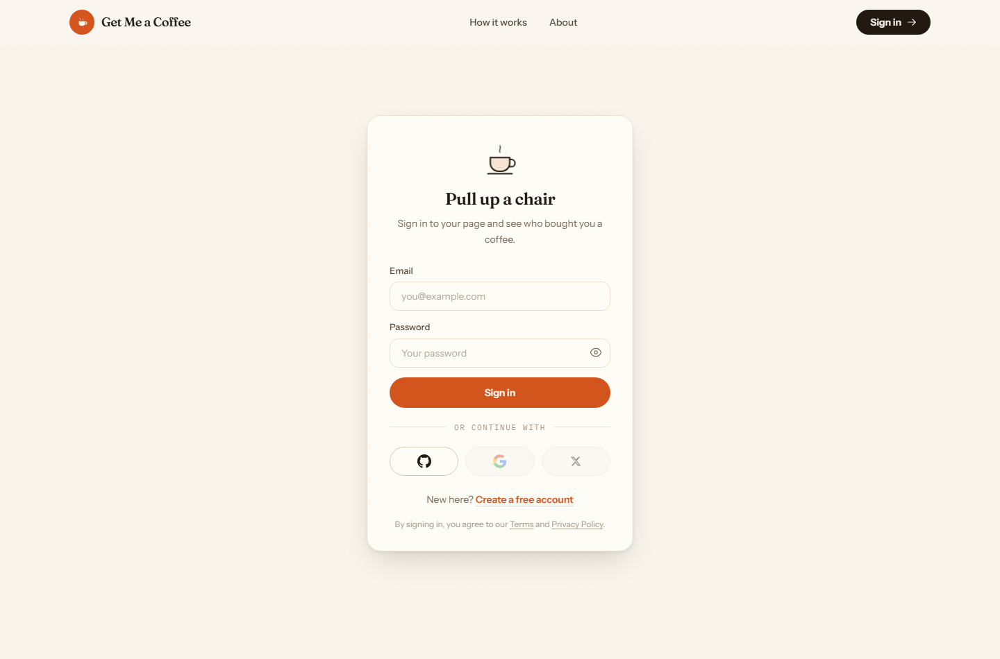
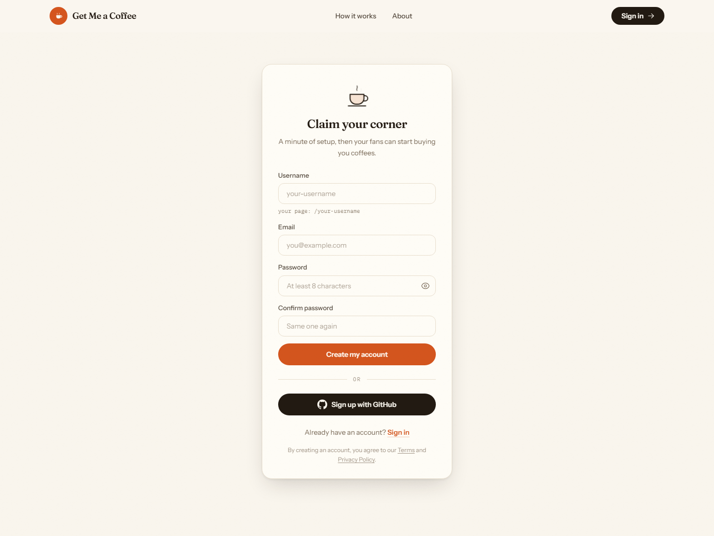
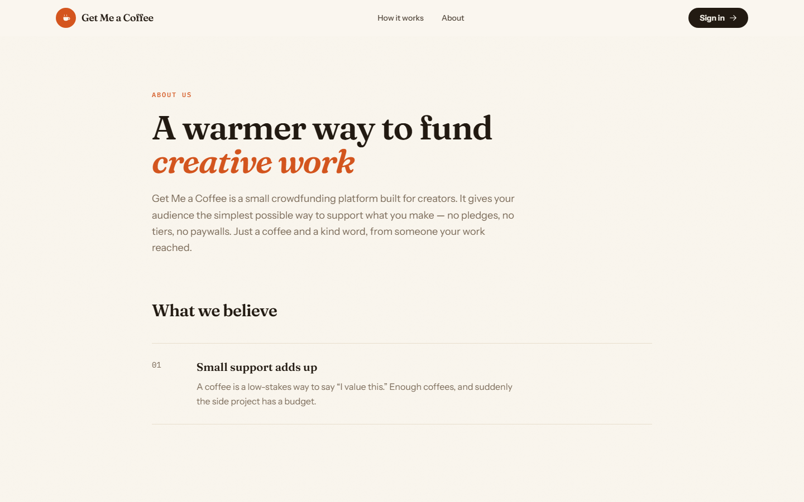

<div align="center">


# Get Me a Coffee

**A warm little crowdfunding platform where fans support creators, one coffee at a time.**

[](https://nextjs.org/)
[](https://react.dev/)
[](https://www.typescriptlang.org/)
[](https://tailwindcss.com/)
[](https://www.mongodb.com/)
[](https://next-auth.js.org/)
[](https://razorpay.com/)

<br />



</div>

<br />

## What is this?

Get Me a Coffee gives creators a personal page where anyone can chip in a few
rupees and leave a note. No pledges, no tiers, no paywalls — a supporter picks
an amount, writes something nice, and pays through Razorpay. The money goes
directly to the creator's own Razorpay account; the platform never holds funds.

<br />

## Screenshots

| Creator page | Login |
| :---: | :---: |
|  |  |

| Sign up | About |
| :---: | :---: |
|  |  |

<br />

## Features

- **Personal creator pages** — every user gets a page at `/username` with a
  cover image, avatar, supporter leaderboard, and payment form
- **Two ways to sign in** — email and password (bcrypt-hashed) or GitHub OAuth,
  both through NextAuth
- **Real payments** — Razorpay Checkout with server-side order creation and
  signature verification; each creator connects their own Razorpay keys
- **Supporter notes** — every contribution carries a message that lands on the
  creator's page
- **Dashboard** — creators manage their profile, images, and payment
  credentials in one place
- **Hand-crafted UI** — an editorial, coffee-shop design with scroll-reveal
  animations, marquee, animated steam, and micro-interactions throughout;
  respects `prefers-reduced-motion`

<br />

## Tech stack

| Layer | Technology |
| --- | --- |
| Framework | Next.js 16 (App Router, Server Actions, Turbopack) |
| UI | React 18, Tailwind CSS 3 |
| Typography | Fraunces, Instrument Sans, IBM Plex Mono via `next/font` |
| Authentication | NextAuth.js — credentials provider + GitHub OAuth |
| Database | MongoDB with Mongoose |
| Payments | Razorpay Checkout + server-side verification |
| Notifications | React Toastify |

<br />

## Getting started

### Prerequisites

- Node.js 18 or newer
- A running MongoDB instance (local install or a free
  [MongoDB Atlas](https://www.mongodb.com/atlas) cluster)
- A [GitHub OAuth app](https://github.com/settings/developers) if you want
  GitHub sign-in (optional — email/password works without it)

### Setup

```bash
# 1. Clone
git clone https://github.com/RahulM1305/Get-Me-A-Coffee.git
cd Get-Me-A-Coffee

# 2. Install dependencies
npm install --legacy-peer-deps

# 3. Configure environment
#    create a .env file in the project root (see table below)

# 4. Run
npm run dev
```

Open [http://localhost:3000](http://localhost:3000), create an account at
`/signup`, and your page is live at `/your-username`.

### Environment variables

| Variable | Description |
| --- | --- |
| `MONGO_URI` | MongoDB connection string, e.g. `mongodb://localhost:27017/chai` |
| `NEXTAUTH_URL` | Base URL of the app, e.g. `http://localhost:3000` |
| `NEXTAUTH_SECRET` | Random string for signing sessions — `openssl rand -base64 32` |
| `NEXT_PUBLIC_URL` | Public base URL used in payment callbacks, e.g. `http://localhost:3000` |
| `GITHUB_ID` | GitHub OAuth app client ID (only for GitHub sign-in) |
| `GITHUB_SECRET` | GitHub OAuth app client secret (only for GitHub sign-in) |

For GitHub sign-in, set the OAuth app's callback URL to
`http://localhost:3000/api/auth/callback/github`.

Razorpay keys are **not** environment variables — each creator enters their own
Key ID and Secret in the dashboard, and payouts go straight to their account.

<br />

## How a payment works

1. A supporter fills in their name, a message, and an amount on a creator's page
2. A server action creates a Razorpay order using the creator's own API keys
   and records a pending payment in MongoDB
3. Razorpay Checkout opens in the browser and collects the payment
4. Razorpay posts the result to `/api/razorpay`, where the signature is
   verified server-side with the creator's secret
5. On success the payment is marked complete and the supporter appears on the
   creator's leaderboard

<br />

## Project structure

```
app/
  page.tsx               Landing page
  about/                 About page
  login/                 Sign in (email/password + OAuth)
  signup/                Account creation
  dashboard/             Creator settings
  [username]/            Public creator page
  api/auth/[...nextauth] NextAuth handlers (credentials + GitHub)
  api/razorpay/          Payment verification webhook
actions/
  useractions.js         Server actions: orders, profile, payments
  authactions.js         Server action: registration
components/
  Navbar.tsx  Footer.tsx  PaymentPage.tsx  Dashboard.tsx
  CoffeeCup.tsx           Animated coffee cup illustration
  Reveal.tsx              Scroll-reveal animation wrapper
db/connectDb.js           Cached Mongoose connection
models/                   User and Payment schemas
```

<br />

<div align="center">

Brewed with care — pull requests welcome.

</div>
